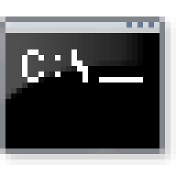

# cmdutils
stupid replica of GNU coreutils but batch/cmd
  
# installation
1. put init.cmd somewhere  
2. launch regedit then go to the following directory:  
3. `HKEY_CURRENT_USER/Software/Microsoft/Command Processor`  
4. then make a string value and make sure it has path to init.cmd
  
# recommendations
get [CLink](http://mridgers.github.io/clink/) to make it even more cursed

# ... why??
I DON'T KNOW WHY
